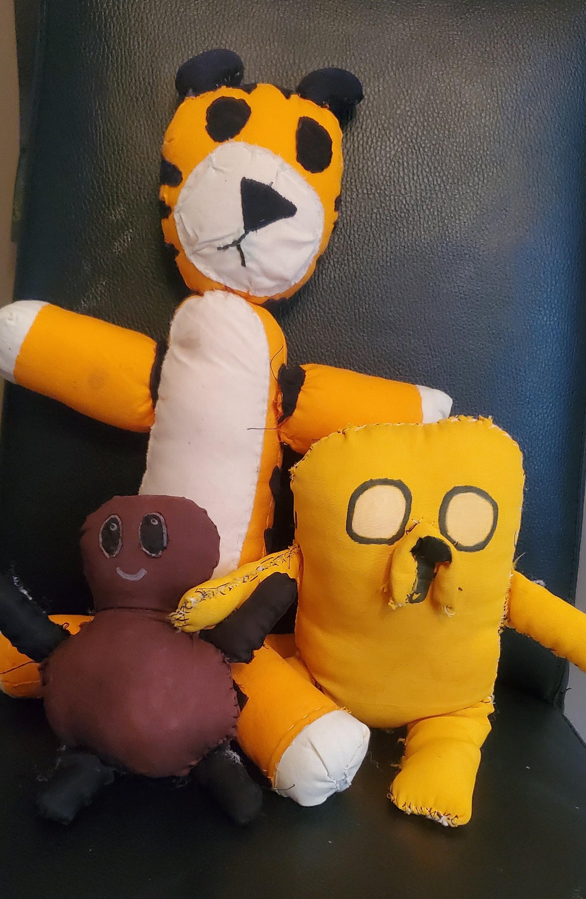
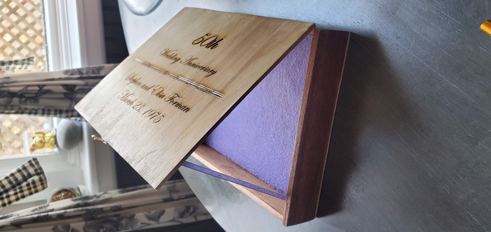
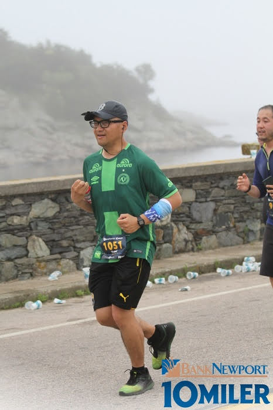

<h3>Linsonjude "Linson" Naval</h3>
<h3>Program and Project Manager</h3>
  
 
    <a href="#Projects">▶ Jump to Projects section</a> 
    <a href="#Awards and Publications">▶ Jump to Awards and Publications section</a> 
    <a href="#Recommendations">▶ Jump to Recommendations section</a> 
    <a href="#Miscellaneous Projects">▶ Jump to Miscellaneous Projects section</a>  
  

<h3>Education</h3>
MBA - Northeastern University 
BA - University of Massachusetts at Amherst

<h3>Resume</h3>
<a href="Linsonjude Naval Resume 2025.pdf">Link to resume - PDF 
</a> 

<h3>Projects</h3>

Note: Due to sensitive nature of many of my work projects (federal government - public trust), only some informal work projects shown at the moment.

<b>Northeastern AI Hackathon</b>
<a href="YOLO for Bird Flu Detection in Chickens.pptx">Link to Presentation 
</a> 
Our hackathon team was trying to leverage computer vision data to provide machine learning to a model in which cameras could identify chickens sick (avian flu or other aliments).  
  

 

<b>Sample REST API</b>

<!--started weather coding here, got help from chatgpt but learned from it and updated on my own-->

<body> 

  <!-- Button to trigger weather fetch -->
  
<button onclick="getWeather()">Fun with a REST API What is the weather where Linson is?</button>

  <!-- Where the weather info will be displayed -->
  

  

 

<!--ended weather coding here-->

<h3><b>Awards and Publications</b></h3> 
<i>Deloitte Collaboration Award 
  
Department of Energy Recovery Act 
  
<a href="https://qualitysafety.bmj.com/content/25/12/993.1">BMJ Quality and Safety</i> 
</a>  

  
<h3><b>Recommendations</b></h3>
<b><i></i>Garrett Kephart - CEO and Co-Founder @ Earth Finance (Garrett managed Linson)</b>i></b> 

I worked closely with Linson for 4 years during our time consulting to the U.S. Department of Energy (DOE). He is a proven delivery and sales leader with exceptional maturity and integrity. Linson is thoughtful, empathetic, and highly analytical. He makes extra effort to establish personal connections with his superiors, peers, and customers. You want something done right that exceeds expectations? Linson is the guy - I highly recommend him!!  

<b><i>Rachael Shapira - Product/Project Manager (reported to Linson)</i></b> 

To Whom It May Concern: 

I am writing to support Linson Naval. It is a pleasure to recommend him because of his ability to balance the needs of the company and the needs of the employee, provide supportive guidance, and foster a positive and encouraging work environment. 

First, Linson demonstrates exceptional communication skills. As a team member at Ad Hoc LLC, I had the pleasure of working under Linson’s management. His ability to listen and make employees feel heard and supported made him an outstanding manager. It was truly a privilege to work with him. For example, when I had concerns about my workload, Linson took the time to sit down with me, listen carefully, and help me address the issues in a way that benefited both me and the company. This made me feel more confident and capable in my role. 

Linson also displays remarkable empathy and emotional intelligence in his leadership. For instance, he was able to give advice and correction without ever making me feel defensive or bad, which is particularly important since I can be pretty sensitive. His approach to constructive feedback made me feel motivated to improve rather than discouraged, fostering a culture of growth and trust. 

Finally, Linson is an exceptional mentor and cheerleader for his team. This trait has been of benefit to our company because his encouragement helped many employees, including myself, exceed our goals and develop professionally. 

Sincerely, 
Rachael Shapira  

<b><i>Steven Hovland - Staff Software Engineer at Ad Hoc (reported to Linson)</i></b>  

Linson was excellent to work for. He was flexible and always focused on completing the work without burning out. He is always positive and willing to help figure out whatever is blocking the work or resolving a personal issue or things related to benefits. Linson is knowledgeable and quick to understand a technical problem or relate to a personal need.

<h3><b>Miscellaneous Projects</b></h3>

<i>Repairs</i> 
 
Replacing the power steering pump and rotted out lines to the pump. I got this car in 2008 and will do my best to keep it going for many more years. So far, replaced the steering pump, bumper, left tail light, side window seals and other little things.  

<i>Sewing</i> 
Hobbes, Jake and Tubby Nugget stuffies (hand sewn) 
 
I made these for my kids. I get better with each iteration. But, the kids love them nevertheless.  

<i>Softball</i> 
 
Playing softball with the UMass Alumni team on the National Mall next to the Washington Monument.  

<i>Wood work</i> 
 
Made a wooden memory box for my in-laws' anniversary. Felt liner and laser engraving.

<i>Jogging</i> 
  

<i>Photography</i> 
  

